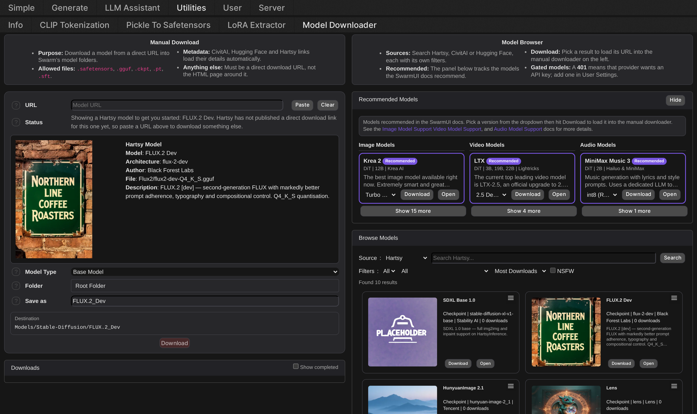
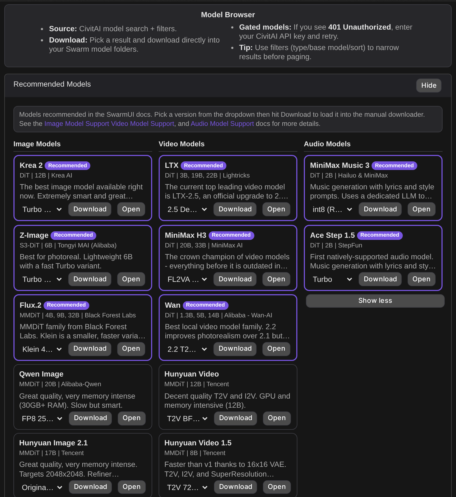
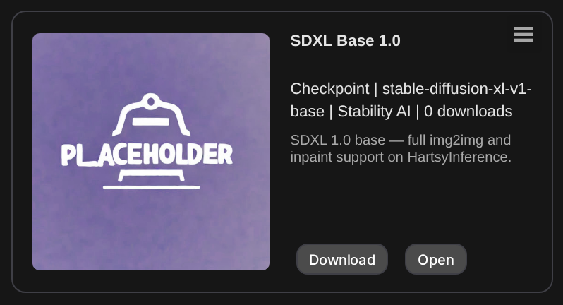
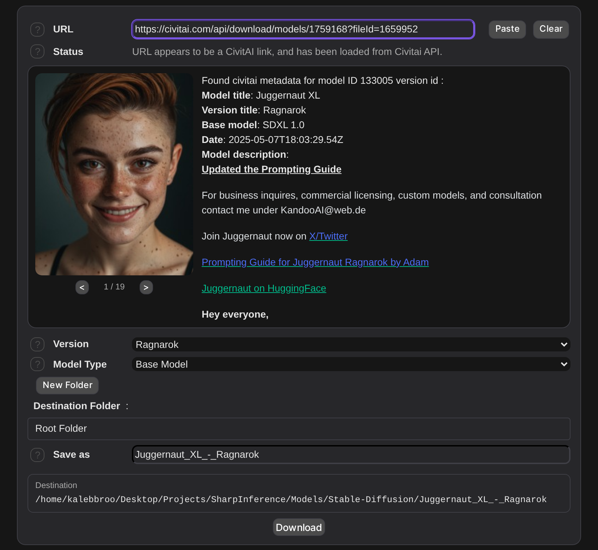
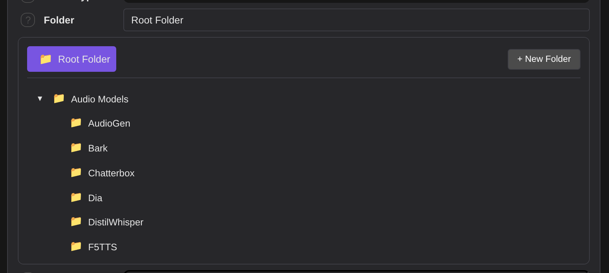
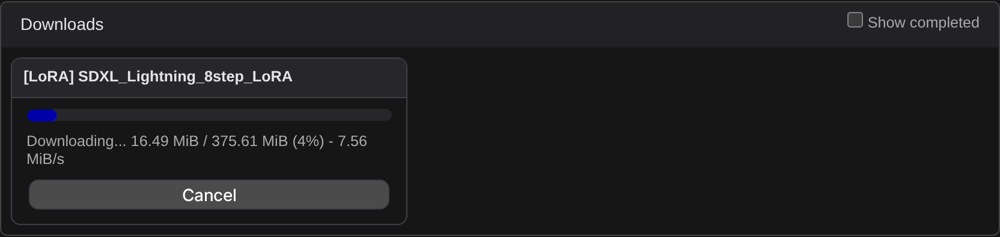
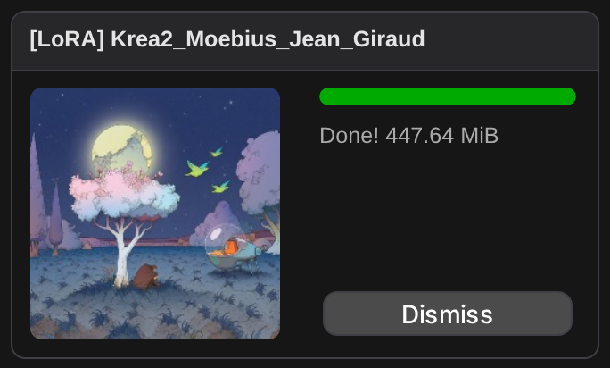
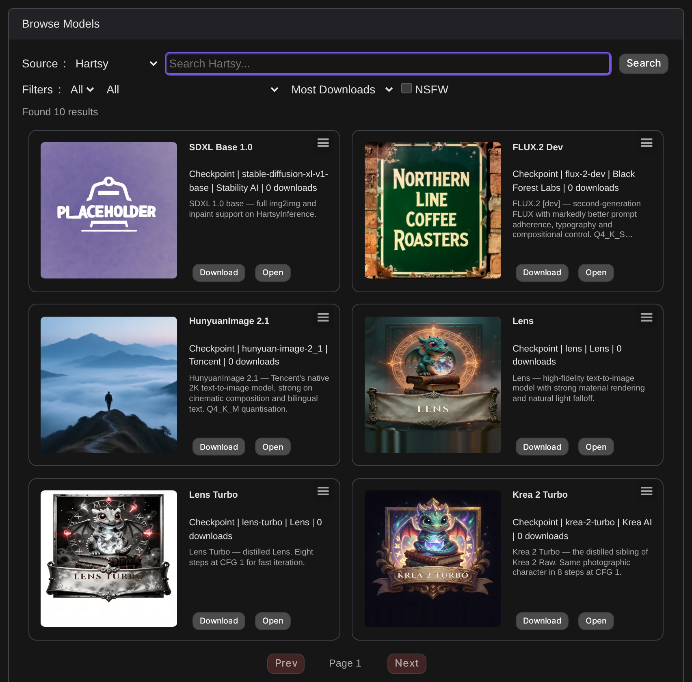
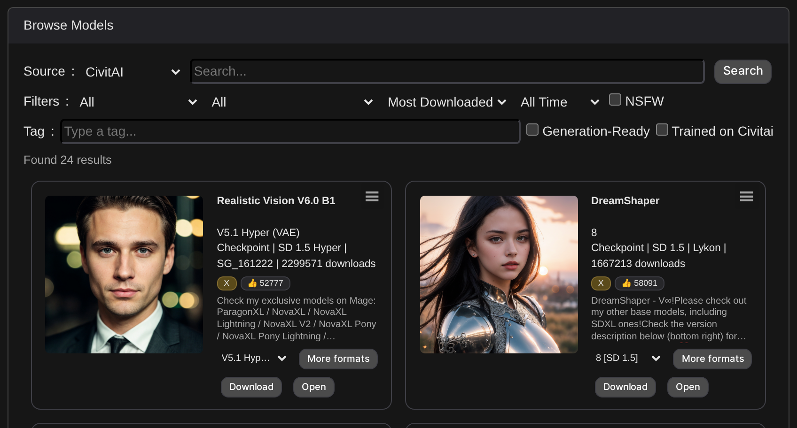
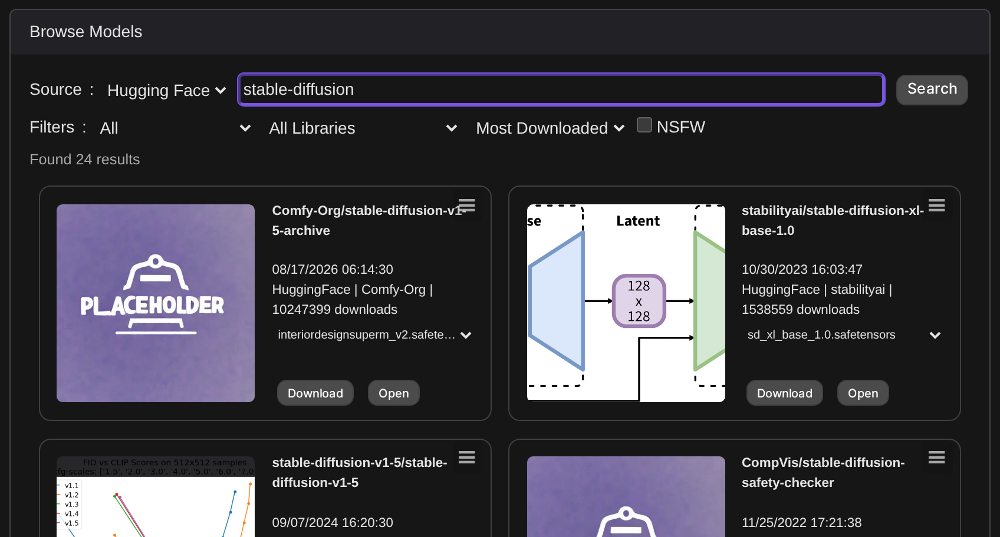

# SwarmUI Enhanced Downloader



A full-featured model browser for [SwarmUI](https://github.com/mcmonkeyprojects/SwarmUI)'s **Utilities > Model Downloader** tab. Search, preview, and download models from **CivitAI**, **Hugging Face**, and **Hartsy** without leaving SwarmUI or hand-typing a URL.

> [!NOTE]
> This extension enhances SwarmUI's built-in Model Downloader. It does not replace it. The manual URL download workflow on the left is still core SwarmUI, just reorganized and given a few extra conveniences (a starter model on arrival, a folder browser, a destination preview). The model browser on the right is new.

## Table of Contents

1. [Features](#features)
2. [Installation](#installation)
3. [Usage](#usage)
4. [Providers](#providers)
5. [Configuration](#configuration)
6. [Network Connections](#network-connections)
7. [Permissions](#permissions)
8. [API Reference](#api-reference)
9. [Troubleshooting](#troubleshooting)
10. [Contributing](#contributing)
11. [License](#license)

## Features

### Model Browser



- **Three providers, one interface**: switch between Hartsy, CivitAI, and Hugging Face with a dropdown; each keeps its own search/filter state
- **Filters**: model type / architecture, base model, sort, tags, and (CivitAI only) NSFW, per provider. See [Providers](#providers) for exactly what each one supports
- **Page or cursor pagination**, whichever the active provider's API uses
- **Model cards**: thumbnail, title, creator, download count, and type/base-model badges, plus a version/format picker on cards that have more than one downloadable file; click a card's thumbnail (or its **Download** button) to load that exact file's URL straight into the manual downloader on the left

  

- **Recommended Models**: a curated panel pulled from the SwarmUI docs' [Image](https://github.com/mcmonkeyprojects/SwarmUI/blob/master/docs/Model%20Support.md), [Video](https://github.com/mcmonkeyprojects/SwarmUI/blob/master/docs/Video%20Model%20Support.md), and [Audio](https://github.com/mcmonkeyprojects/SwarmUI/blob/master/docs/Audio%20Model%20Support.md) docs. Three columns, each model showing its architecture/scale/author and a variant dropdown (FP8, BF16, GGUF, NVFP4, LoRAs, etc.); pick a variant and hit **Download** to load it into the manual downloader, or **Open** to view the source page. Current top picks carry a **Recommended** badge. The panel and each column's overflow are independently collapsible, and remember their state.

### Manual Downloader Enhancements



> [!NOTE]
> The **Version** and **File** dropdowns that appear when you paste a CivitAI link are core SwarmUI's, as of its 2026-08-17 Model Downloader update, not this extension's. The extension leaves them alone, and clears them when you replace the loaded model with a Hartsy link.

- **A model to start from**: opening the tab loads a random Hartsy model into the downloader, with its preview image, architecture, author and file name filled in, so the panel is never a blank form. It only fills empty fields, so it never overwrites a URL you pasted
- **Folder browser**: a collapsible tree of your existing model folders, shown in place of core's flat Folder dropdown and sitting in the same field row; expand and collapse branches, or create a subfolder with **+ New Folder** without leaving the page

  

- **Destination preview**: a live path showing exactly where the file will land, updating as you change type/folder/name. It is shown relative to your model root (`Models/Lora/MyModel`) rather than as an absolute path, so a shared instance does not print the server's filesystem layout to every user
- **Clipboard paste button** for the URL field
- **Auth error messages**: a download refused with a 401 or 403 shows the provider's own stated reason and which API key to set, using core SwarmUI's shared download error handling, plus a direct link to User Settings
- **Resumable downloads**: download state is persisted server-side, so a SwarmUI restart mid-download leaves it paused (not lost); pause, resume, retry, and clear all work per-download from the Downloads list under the manual downloader

### Performance

- Search results cached 60 seconds per provider/query to avoid redundant API calls
- Hugging Face preview images cached 5 minutes (evicted past 100 entries)
- Per-provider concurrent request caps (3 for CivitAI/Hartsy, 5 for Hugging Face) so a burst of card renders can't hammer an upstream API
- Model folder paths cached 30 seconds

## Installation

### Preferred Method (via SwarmUI)

1. Open your SwarmUI instance
2. Go to `Server` > `Extensions`
3. Find **Enhanced Downloader** and click **Install**
4. Restart SwarmUI when prompted

### Manual Installation

1. Close SwarmUI
2. Clone this repo into `SwarmUI/src/Extensions/SwarmUI-EnhancedDownloader/`:
   ```bash
   cd SwarmUI/src/Extensions/
   git clone https://github.com/HartsyAI/SwarmUI-EnhancedDownloader.git
   ```
3. Restart SwarmUI (or use one of the `launch-*-dev` scripts, which rebuild on every launch); the extension compiles automatically
4. Confirm it's enabled under `Server` > `Extensions`

No extra setup is required. Every API key described below is optional, and every provider works anonymously out of the box.

## Usage

### Browsing and downloading a model

1. Open **Utilities** > **Model Downloader**
2. Pick a provider from the **Source** dropdown on the right (Hartsy is the default)
3. Type a search query, or just scroll the default results
4. Narrow with the filter dropdowns where the provider supports them
5. Click a card's thumbnail, or its **Download** button, to load that file's URL into the **URL** field on the left
6. Pick (or create) a destination folder, confirm the **Save as** name, and click **Download**

Pasting a URL directly (CivitAI, Hugging Face, or any other direct-download link) works the same as it always has in SwarmUI. The browser on the right is a convenience on top, not a requirement.

### Recommended Models

Open the **Recommended Models** panel, pick a variant from a model's dropdown, and click **Download** to load it into the manual downloader, or **Open** to view its source page first. This list mirrors the current docs' recommendations, so it changes as SwarmUI's own recommendations do.

### Managing downloads

Downloads appear in the **Downloads** list under the manual downloader as soon as you start one. Each shows live progress: bytes transferred, percentage, and speed where the server reports a total size.



An in-progress download can be **Cancel**ed, which keeps the partial file so it can be resumed. A paused or errored one can be **Resume**d or **Retry**d from where it left off, or **Clear**ed to delete the partial file.



Finished downloads turn green and can be **Dismiss**ed. They are hidden by default; tick **Show completed** to keep them in the list.

## Providers

| Provider | Search | Filters | NSFW | Pagination | API Key |
|----------|--------|---------|------|------------|---------|
| **Hartsy** | Yes | Architecture, tags, sort | No | Page-based | Optional |
| **CivitAI** | Yes | Type, base model, sort, period, tag, username | Yes (permission-gated) | Cursor (searches) / page (browse) | Optional |
| **Hugging Face** | Yes | Pipeline tag, library, sort, author | No | Cursor-based | Optional |

### Hartsy



[Hartsy](https://hartsy.ai) is a curated model repository being built by the team behind this extension.

> [!IMPORTANT]
> **Hartsy.ai is not yet publicly released.** While it's in this pre-release state, the catalog only contains **base model repackages** (SDXL, FLUX.2, Krea 2, HunyuanImage, and similar; see the screenshot above) rather than community finetunes or LoRAs. Browsing and downloading through this provider works today, but expect the catalog to grow substantially once the site is live.

**Filters:** architecture, tags, sort (newest/updated/title/downloads).

**Notes:**
- Hartsy is the default provider when the browser loads
- A pasted Hartsy model link (either `hartsy.ai/models/<id>` or `hartsy.ai/Home?type=models&id=<id>`) resolves through the Hartsy API automatically, the same way a CivitAI link does, so you don't need to use the browser for it to work
- If a specific model doesn't have a direct download link available yet, the manual downloader says so explicitly and disables the Download button, rather than failing silently
- An optional Hartsy API key raises rate limits and unlocks anything gated; browsing works anonymously either way, and an invalid or missing key falls back to a public/anonymous request automatically instead of returning zero results

### CivitAI



[CivitAI](https://civitai.com) is the largest community model repository.

**Filters:** type (Checkpoint, LoRA, VAE, ControlNet, etc.), base model, sort, time period, tag, username (also parseable straight out of `@username` in the search box).

**Notes:**
- Browsing without a search query uses page-based pagination; searching by name uses CivitAI's cursor-based pagination
- NSFW results require the `enhanced_downloader_nsfw` permission (see [Permissions](#permissions)) *and* toggling the NSFW checkbox. With both, requests route through `civitai.red` instead of `civitai.com`
- An API key unlocks gated/early-access models and raises rate limits
- File selection prioritizes `.safetensors`; pasting a model or version URL auto-populates version and file dropdowns in the manual downloader

### Hugging Face



[Hugging Face](https://huggingface.co) hosts a huge range of ML models.

**Filters:** pipeline tag (text-to-image, image-to-video, text-to-speech, etc.), library (diffusers, transformers, gguf, safetensors, etc.), sort, author.

**Notes:**
- Preview images are fetched lazily with a multi-strategy lookup (common filenames, then the repo's file listing, then parsing the README), so a thumbnail may take a moment to appear or may not be available for every repo
- File listings are filtered to model-relevant extensions (`.safetensors`, `.gguf`, `.ckpt`, etc.) and show file size
- An API token unlocks gated/private repos

## Configuration

### API Keys (all optional)

Every provider works anonymously. Adding a key raises rate limits and/or unlocks gated content:

1. Open **User** > **User Settings**
2. Add whichever keys you want under API Keys:
   - **CivitAI API Key**
   - **Hugging Face API Key**
   - **Hartsy API Key**

> [!WARNING]
> Never share your API keys. They're stored in your SwarmUI user data and are only ever sent to the corresponding provider's API.

### NSFW filtering

NSFW results are off by default and only apply to CivitAI (Hartsy and Hugging Face don't expose an NSFW toggle at all). To see them:

1. Grant the `enhanced_downloader_nsfw` permission to your user/group under `Server` > `Users & Permissions`
2. Check the NSFW box in the CivitAI browser's filter row

## Network Connections

This extension talks to external hosts only when you actively search, browse, or download through it, never in the background, and never without you having initiated the action:

| Host | When | Why |
|---|---|---|
| `civitai.com` / `civitai.red` | Searching/browsing CivitAI, loading a pasted CivitAI URL's metadata, downloading a CivitAI file | CivitAI's public API + CDN (`civitai.red` is used instead of `civitai.com` specifically for NSFW-enabled requests) |
| `huggingface.co` | Searching/browsing Hugging Face, loading file listings/preview images, downloading a file | The Hugging Face Hub API |
| `hartsy.ai` | Searching/browsing Hartsy, resolving a pasted Hartsy link, downloading a Hartsy file | The Hartsy API |

There's no way to disable the extension's network access short of disabling the extension itself (per [SwarmUI's extension standards](https://github.com/mcmonkeyprojects/SwarmUI/blob/master/docs/Making%20Extensions.md#extension-standards), everything above is a connection you triggered, not one made on your behalf).

## Permissions

Three permissions, all defaulting to **POWERUSERS**:

| Permission | Description |
|-----------|-------------|
| `enhanced_downloader` | Base access: listing providers, download roots, and the recommended-models list |
| `enhanced_downloader_browse` | Searching/browsing models across providers |
| `enhanced_downloader_nsfw` | Including NSFW results (CivitAI only) |

Configure these under `Server` > `Users & Permissions`.

Starting, resuming, canceling, or clearing an actual download uses SwarmUI core's own `Permissions.DownloadModels` permission, not one of the three above. A user needs that core permission regardless of whether they can browse.

## API Reference

All endpoints are SwarmUI `API.RegisterAPICall` handlers (POST, JSON in/out), registered in `WebAPI/EnhancedDownloaderAPI.cs`.

### Discovery

| Endpoint | Permission | Params | Returns |
|---|---|---|---|
| `ListProviders` | `enhanced_downloader` | none | `{providers:[{id, displayName, supportsFilters, supportsNsfw}]}` |
| `EnhancedDownloaderGetDownloadRoots` | `enhanced_downloader` | none | `{roots:{modelType: folderPath}}` |
| `EnhancedDownloaderGetFeaturedModels` | `enhanced_downloader` | none | `{models:[{name, category, note, architecture, author, scale, isRecommended, downloads:[{label, url}]}]}` |

### CivitAI

| Endpoint | Params | Returns |
|---|---|---|
| `EnhancedDownloaderCivitaiSearch` | `query`, `page`, `limit`, `cursor`, `type`, `baseModel`, `sort`, `includeNsfw`, `period`, `username`, `tag`, `supportsGeneration`, `fromPlatform` | `{mode:"cursor"\|"page", page, totalPages, totalItems, nextCursor, items}` |
| `EnhancedDownloaderCivitaiFilterOptions` | none | `{types, baseModels}` (live from CivitAI's `/api/v1/enums`) |
| `EnhancedDownloaderCivitaiTags` | `query`, `limit` | `{tags:[{name, modelCount}]}` |
| `EnhancedDownloaderCivitaiImages` | `modelVersionId`, `limit`, `includeNsfw` | `{images:[{url, width, height, nsfwLevel, prompt, ...}]}` |
| `EnhancedDownloaderCivitaiVersionFiles` | `modelVersionId` | `{files:[{fileName, downloadUrl, fileSize, format, precision, primary}]}` |
| `EnhancedDownloaderCivitaiVersionCheck` | `modelVersionId` | `{requireAuth, canGenerate, earlyAccessEndsAt, hasApiKey, ...}` |

All CivitAI endpoints require `enhanced_downloader_browse`.

### Hugging Face

| Endpoint | Params | Returns |
|---|---|---|
| `EnhancedDownloaderHuggingFaceSearch` | `query`, `limit`, `cursor`, `pipelineTag`, `library`, `sort`, `author` | `{mode:"cursor", nextCursor, totalItems, items}` |
| `EnhancedDownloaderHuggingFaceFiles` | `modelId` (required), `limit` | `{files:[{fileName, downloadUrl, fileSize, quantType}], truncated}` |
| `EnhancedDownloaderHuggingFaceImage` | `modelId` (required) | `{image:"data:image/...;base64,..."}` |

All require `enhanced_downloader_browse`.

### Hartsy

| Endpoint | Params | Returns |
|---|---|---|
| `EnhancedDownloaderHartsySearch` | `query`, `page`, `limit`, `architecture`, `sort`, `tags` | `{mode:"page", page, totalPages, totalItems, hasMore, items}` |
| `EnhancedDownloaderHartsyFilterOptions` | none | `{architectures, tags, uploadSources, subscriptionTiers}` |
| `EnhancedDownloaderHartsyModelDetails` | `modelId` (required) | `{title, description, architecture, author, image, downloads, tags, ...}` (cached, no analytics recorded) |
| `EnhancedDownloaderHartsyDownload` | `modelId` (required) | `{downloadUrl, fileName, fileSize, hashSha256, torrent?}` (records a download analytics event on Hartsy's side, not cached) |
| `EnhancedDownloaderHartsyVersions` | `modelId` (required) | `{versions:[{id, title, versionLabel, architecture, ...}]}` |

All require `enhanced_downloader_browse`.

### Download lifecycle

| Endpoint | Permission | Params | Returns |
|---|---|---|---|
| `EnhancedDownloaderListDownloads` | `enhanced_downloader` | none | `{downloads:[DownloadRecord]}` |
| `EnhancedDownloaderStartDownload` | `Permissions.DownloadModels` | `url`, `type`, `name` (all required), `metadata`, `image` | `{download: DownloadRecord}` |
| `EnhancedDownloaderResumeDownload` | `Permissions.DownloadModels` | `id` (required) | `{download: DownloadRecord}` |
| `EnhancedDownloaderCancelDownload` | `Permissions.DownloadModels` | `id` (required) | `{download: DownloadRecord}` |
| `EnhancedDownloaderClearDownload` | `Permissions.DownloadModels` | `id` (required) | `{success: true}` |

A `DownloadRecord` looks like:
```json
{
  "id": "...", "url": "...", "type": "...", "name": "...", "extension": "...", "image": "...",
  "totalBytes": 0, "downloadedBytes": 0, "perSecond": 0,
  "state": "downloading | paused | errored | completed",
  "error": "...", "note": "...", "createdAtMs": 0, "updatedAtMs": 0
}
```

Downloads are persisted per-user (LiteDB generic data) so a SwarmUI restart mid-download resumes as **paused**, not lost.

## Troubleshooting

### A download is refused (401 or 403)

The failure message names the provider that refused it, quotes the reason that provider gave, and says whether an API key was sent. Add or check the relevant provider's API key in **User Settings** (see [Configuration](#configuration)), then Retry from the Downloads list.

### No search results

- Check your connection
- Try a different query or loosen the filters
- Check SwarmUI's logs for the underlying API error
- For CivitAI, confirm your API key if you're after gated content

### Browser panel missing

1. Confirm the extension is enabled under `Server` > `Extensions`
2. Restart SwarmUI after enabling it
3. Reload the page. Note that a browser hard-refresh on its own is not enough after an extension JS/CSS change: SwarmUI reads those files once per launch and serves them from memory, so the server has to restart first
4. Check the browser console for JS errors

### Missing preview images

Hugging Face images are fetched lazily and aren't guaranteed for every repo; CivitAI images depend on what the model's author uploaded. Check the browser console for fetch errors if a specific thumbnail seems stuck.

## Contributing

Contributions welcome. Areas that would help most:
- Additional provider integrations
- Wiring up the per-card extras popover (`model_popover.js`/`getPopoverExtras` exist but aren't currently attached to a visible trigger on the card)
- A real download-history feature (`download_history.js` is currently a placeholder)
- Surfacing recent destination folders in the folder tree (the last 12 are still recorded to `localStorage`, but nothing displays them since the folder tree replaced core's dropdown)
- Making **+ New Folder** show the folder it just created in the tree (it selects correctly and the download lands in the right place, but `buildFolderBrowser()` re-renders from `coreModelMap`, so a folder with no models in it yet never appears)
- Improved model metadata display
- Better error messages and user guidance

## License

MIT License. See [LICENSE](LICENSE).

## Credits

- [SwarmUI](https://github.com/mcmonkeyprojects/SwarmUI) by mcmonkey
- [CivitAI](https://civitai.com) for their public model API
- [Hugging Face](https://huggingface.co) for the Hub API
- [Hartsy AI](https://hartsy.ai) for the Hartsy model platform
- The [Hartsy Discord Community](https://discord.gg/nWfCupjhbm) for testing and feedback
